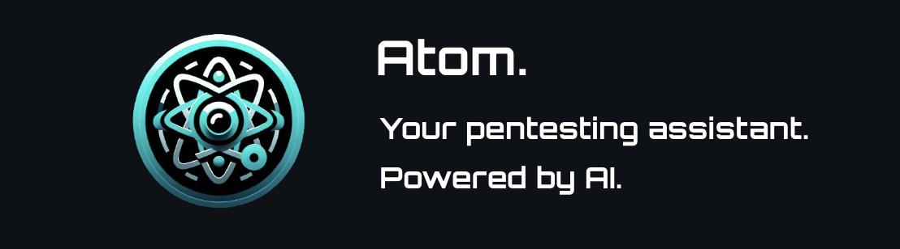

# Atom Pro: Penetration Testing AI Assistant (With More Security)



## Overview

Atom Pro is an enhanced version of the Atom penetration testing (pentest) AI assistant, designed with professional security experts in mind. By leveraging the power of GPT-4 and incorporating advanced security features, Atom Pro provides a secure and powerful conversational interface to assist users in mapping, understanding, and exploiting their attack surface with unparalleled insight.

### New Features in Atom Pro

- **SSL-enabled UI:** Using the Pywebiosecure library instead of Pywebio, the UI now features auto-generated TLS 1.3 SSL certificates by default. Furthermore, you can generate your own certificates and use the BYOC (Bring Your Own Cert) feature by editing the "ui.py" file to reference your cert file locations. If BOYC interests you, reference Pywebiosecure's repo to view a code example where paths to the cert files are specified: https://github.com/andrewcampi/pywebiosecure

- **Improved Information Security:** Pentest data needs to stay secure, as it is confidential and highly sensitive. Therefore, professional pentesters do not want to send data back and forth to OpenAI via the GPT API. To account for this, Atom Pro is set up to interface with LMStudio, a software that you can install to run LLM models locally and set up an API to interact with it. This way, all sensitive data remains secure and is not shared with a third party.

### Core Features

- **Attack Surface Mapping:** Atom Pro helps map out the attack surface, providing a clear view of potential entry points for penetration testing.

- **Dynamic Attack Path Generation:** Atom Pro dynamically maps attack paths tailored to the specific attack surface, allowing for a customized approach to each pentest.

- **Conversational Interface:** Engage with Atom Pro in a chat-like interface, making pentesting more intuitive and accessible. Atom Pro stays fully informed about the current pentest data at all times.

- **CVE Research:** Atom Pro can automatically research Common Vulnerabilities and Exposures (CVEs) using the NIST vulnerability database and ExploitDB, ensuring up-to-date vulnerability and exploit data.

- **Command Generation:** Atom Pro provides ready-to-use commands, complete with target IPs and specific command-line arguments, streamlining the testing process.

- **API Server:** A comprehensive API server with numerous endpoints supports automation and integration with other tools.

- **Detailed Documentation:** The UI includes detailed API documentation, making it easy for users to understand and utilize Atom Pro's full capabilities.

## Getting Started

### Prerequisites

Ensure you have Python 3 installed on your system. Atom Pro's dependencies are listed in 'requirements.txt', which can be installed using pip. Additionally, you will need to install OpenSSL and LMStudio:

1. Install OpenSSL:

```sh
sudo apt-get install openssl -y
```

2. Install LMStudio by following the instructions at [https://lmstudio.ai/](https://lmstudio.ai/). Configure it properly, download the model of your choice, and turn on the "API server" feature.

### Installation

1. Clone this repository or download the ZIP file.

2. Navigate to the Atom Pro directory.

3. Install the required Python packages:

```sh
pip3 install -r requirements.txt
```

### Configuration

#### 'helper/project_info.py'

Enter the IP address of your LMStudio API, port, and model name.

### DISCLAIMER

Since we are not using OpenAI for the pro version, the quality of Atom Pro's response is directly tied to the quality of the LLM you select. 
I tested this using Mistral7B and the quality was significantly lower than using OpenAI, to the point where the responses were causing errors. 
It is highly recommended to select a model of GPT-3.5 quality level or higher (research some benchmarks to make sure you are selecting a quality model). That being said, runing a 70B model would require a very powerful rig. 

Open Source LLM Leaderboard: https://huggingface.co/spaces/HuggingFaceH4/open_llm_leaderboard

### Running Atom Pro

To run Atom Pro's server:

```sh
python3 server.py
```

To access Atom Pro's user interface (UI), both the server and the UI need to be running concurrently:

1. Start the server:

```sh
python3 server.py
```

2. In a separate terminal, start the UI:

```sh
python3 ui.py
```

## Using Atom Pro

Once the server and UI are running, access Atom Pro's UI through your web browser to start your pentesting session. Atom Pro's conversational interface will guide you through mapping your attack surface, researching vulnerabilities, and crafting your attack path.

Refer to the detailed API documentation included in the UI for information on how to extend Atom Pro's functionality or integrate it with your existing tools and workflows.

## Video Overview

For a comprehensive overview and a demo of Atom in action, check out this example video:

https://youtu.be/uWRG7rv38jI 
